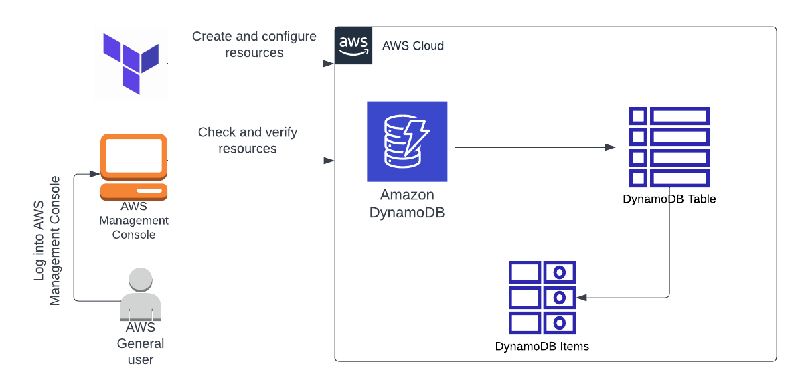

***Create DynamoDB Table and Insert Items to table using Terraform***

### Prerequisites
- Install terraform in your Local Machine using the official guide by Hashicorp.
- To install terraform using CLI, use this guide https://learn.hashicorp.com/tutorials/terraform/install-cli 
- To install terraform by downloading, use this guide https://www.terraform.io/downloads 
- Download and install Visual Studio Code editor using this guide https://code.visualstudio.com/download

