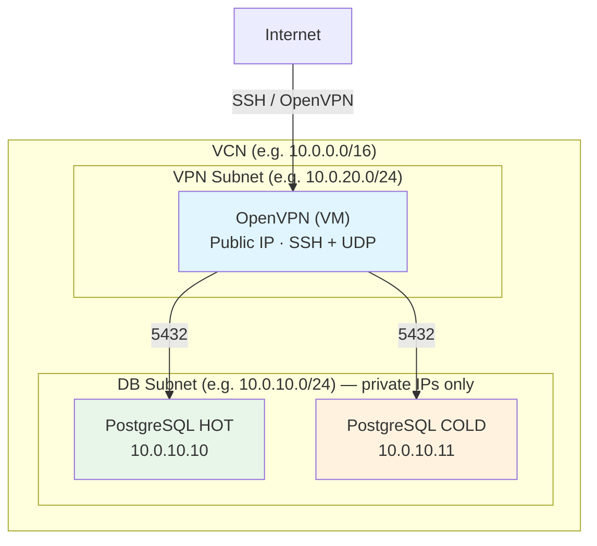

# PostgreSQL Hot/Cold Lab — OCI Terraform

Terraform module that provisions a complete **PostgreSQL lab** on Oracle Cloud Infrastructure (OCI): a dedicated compartment, shared PostgreSQL configuration, **two** DB Systems (HOT and COLD), a single VCN with DB and VPN subnets, and an **OpenVPN** instance for secure access to the databases. **Always run Terraform from this directory (`psql/`).**

---

## Table of Contents

- [Overview](#overview)
- [Architecture](#architecture)
- [Regions](#regions)
- [Prerequisites](#prerequisites)
- [Variables](#variables)
- [Quick Start](#quick-start)
- [Outputs](#outputs)
- [Accessing the Database via VPN](#accessing-the-database-via-vpn)
- [Destroy](#destroy)
- [Directory Structure](#directory-structure)
- [Scripts](#scripts)
- [Troubleshooting](#troubleshooting)
- [Security Notes](#security-notes)

---

## Overview

| Component | Description |
|-----------|-------------|
| **Compartment** | `psql_hot_cold_lab` — created in the tenancy **home region** (e.g. São Paulo / GRU). |
| **Network** | One VCN; private subnet for PostgreSQL; subnet with public IP for OpenVPN. |
| **PostgreSQL** | One shared **configuration** plus two **DB Systems**: **HOT** (production-like) and **COLD** (archive), in the region set by `oci_region`. |
| **OpenVPN** | One compute instance (e.g. Ubuntu) in the VPN subnet; DB access only via VPN. |

---

## Architecture



**Creation order (dependencies):**

1. **compartment.tf** — Compartment `psql_hot_cold_lab` (provider `oci.home`, home region).
2. **main.tf** — `time_sleep.wait_compartment_propagation` (90s).
3. **network.tf** — VCN, IGW, DB subnet (private), VPN subnet (public), security lists, NSGs, route table.
4. **psql_conf.tf** — PostgreSQL configuration (E5.Flex shape, overrides).
5. **psql.tf** — DB System HOT and DB System COLD.
6. **instance_ovpn.tf** — OpenVPN instance (cloud-init using `scripts/openvpn-ubuntu-install.sh`).

The DB subnet allows traffic from the **entire VCN** (including the VPN subnet), so clients connected via OpenVPN can reach PostgreSQL on port 5432.

---

## Regions

- **Home region** (`home_region`, e.g. `sa-saopaulo-1`): used **only** for creating/updating the **compartment** (Identity requires the home region).
- **Resource region** (`oci_region`, e.g. `us-ashburn-1`): where VCN, subnets, DB Systems, configuration, and the OpenVPN instance are created.

After creating the compartment, the module waits **90 seconds** (`time_sleep`) before creating the VCN and configuration in the resource region to avoid 404s due to compartment propagation.

---

## Prerequisites

- **Terraform** >= 1.5
- **OCI CLI** configured: `~/.oci/config` with a profile (e.g. `DEFAULT`) containing `user`, `fingerprint`, `tenancy`, `region`, and `key_file`
- **SSH key pair** for the OpenVPN instance (path set in `ssh_public_key_path`)
- **Parent compartment OCID** where `psql_hot_cold_lab` will be created (`parent_compartment_id`)
- **Ubuntu image OCID** for the OpenVPN instance (`image_id`) in the chosen region

---

## Variables

Variables are defined in `variables.tf`. Summary by group:

### Provider & common

| Variable | Description |
|----------|-------------|
| `oci_region` | Region for VCN, subnets, DB systems, OpenVPN (e.g. `us-ashburn-1`). |
| `home_region` | Tenancy home region; used only for the compartment (e.g. `sa-saopaulo-1`). |
| `oci_config_profile` | OCI CLI profile name in `~/.oci/config`. |
| `parent_compartment_id` | OCID of the parent compartment for `psql_hot_cold_lab`. |
| `compartment_id` | Optional; use existing compartment OCID instead of creating one. |
| `common_tags` | `defined_tags` applied to taggable resources (e.g. `finops.*`). |

### DB System (HOT)

| Variable | Description |
|----------|-------------|
| `db_system_display_name` | Display name for the HOT DB System. |
| `db_system_description` | Description. |
| `db_version` | PostgreSQL version (e.g. `14`). |
| `instance_count` | Number of instances. |
| `instance_memory_size_in_gbs` | Memory per instance (GB). E5.Flex minimum 16 in configuration; DB system can use less when supported. |
| `instance_ocpu_count` | OCPUs per instance. |
| `db_system_shape` | Shape (e.g. `PostgreSQL.VM.Standard.E5.Flex`). |
| `system_type` | e.g. `OCI_OPTIMIZED_STORAGE`. |
| `primary_db_endpoint_private_ip` | Private IP for the primary endpoint (must be in `subnet_cidr_block`). |
| `maintenance_window_start` | e.g. `MON 00:00`. |
| `backup_start`, `backup_days_of_the_month`, `backup_days_of_the_week` | Backup schedule. |
| `backup_kind` | e.g. `MONTHLY`. |
| `backup_retention_days` | Retention in days. |
| `storage_iops`, `is_regionally_durable` | Storage options. |
| `availability_domain` | AD for storage (e.g. `giZW:US-ASHBURN-AD-1`). |
| `db_username`, `db_password` or `db_password_secret_id` | DB admin credentials (use secret for production). |
| `source_type` | `NONE` for new DB, `BACKUP` for restore. |
| `is_reader_endpoint_enabled` | Enable reader endpoint. |

### DB System (COLD)

| Variable | Description |
|----------|-------------|
| `cold_db_system_display_name` | Display name for COLD. |
| `cold_db_system_description` | Description. |
| `cold_instance_memory_size_in_gbs`, `cold_instance_ocpu_count` | Override HOT values. |
| `cold_primary_db_endpoint_private_ip` | Private IP for COLD primary. |
| `cold_backup_kind`, `cold_backup_retention_days` | Override backup (often `NONE` / `0` for archive). |

### Network

| Variable | Description |
|----------|-------------|
| `vcn_cidr_block` | VCN CIDR (e.g. `10.0.0.0/16`). |
| `vcn_display_name`, `vcn_dns_label` | VCN metadata. |
| `subnet_cidr_block` | DB subnet (e.g. `10.0.10.0/24`). |
| `subnet_display_name`, `subnet_dns_label` | Subnet metadata. |
| `nsg_display_name` | NSG for PostgreSQL. |

### OpenVPN

| Variable | Description |
|----------|-------------|
| `ssh_public_key_path` | Path to SSH public key for the OpenVPN instance. |
| `ssh_private_key_path` | Optional; for scripts. |
| `image_id` | OCID of Ubuntu (or compatible) image. |
| `vpn_subnet_cidr` | VPN subnet (e.g. `10.0.20.0/24`). |
| `db_subnet_cidr` | Same as DB subnet CIDR (for security list / routing). |
| `openvpn_port` | UDP port for OpenVPN (e.g. `1194`). |
| `instance_display_name` | Display name for the VPN instance. |
| `instance_shape` | e.g. `VM.Standard.E3.Flex`. |
| `instance_memory_gb`, `instance_ocpus` | Shape config. |
| `ssh_allowed_cidr` | CIDR allowed to SSH to the VPN instance (e.g. `0.0.0.0/0` for any). |

Set all values in `terraform.tfvars` (see [Security notes](#security-notes)); do not commit secrets.

---

## Quick Start

1. **Copy and edit variables** (create `terraform.tfvars` if needed; an example is in the parent [NVT README](../README.md)):

   - `parent_compartment_id`, `oci_region`, `home_region`
   - `availability_domain`, `primary_db_endpoint_private_ip`, `cold_primary_db_endpoint_private_ip`
   - DB HOT/COLD settings, backup, storage
   - Network (VCN, subnets, NSG names)
   - DB credentials (`db_username`, `db_password` or `db_password_secret_id`)
   - OpenVPN: `ssh_public_key_path`, `image_id`, `ssh_allowed_cidr`, `common_tags`

2. **Initialize and apply** (from this directory):

   ```bash
   cd psql
   terraform init
   terraform plan
   terraform apply
   ```

3. **Wait for OpenVPN cloud-init** (optional check):

   ```bash
   ssh ubuntu@$(terraform output -raw vpn_public_ip) 'sudo cat /var/log/openvpn-install.log'
   ```

---

## Outputs

| Output | Description |
|--------|-------------|
| `compartment_id` | OCID of the compartment used. |
| `vcn_id`, `subnet_id`, `vpn_subnet_id` | Network identifiers. |
| `psql_configuration_id` | Shared PostgreSQL configuration. |
| `db_system_id`, `db_system_display_name`, `state`, `primary_endpoint_private_ip` | HOT DB System. |
| `db_system_cold_id`, `db_system_cold_display_name`, `cold_primary_endpoint_private_ip` | COLD DB System. |
| `vpn_public_ip` | Public IP for OpenVPN (use as `remote` in client `.ovpn`). |
| `ssh_connect` | Example: `ssh ubuntu@<vpn_public_ip>`. |

---

## Accessing the Database via VPN

1. Get the VPN public IP:  
   `terraform output vpn_public_ip`

2. Copy the client config from the OpenVPN instance:  
   `scp ubuntu@<vpn_public_ip>:/etc/openvpn/client-configs/files/openvpn-config.ovpn .`  
   (If the default client was not created, add one via the script menu on the VM — see [Scripts](#scripts).)

3. If the `.ovpn` file has `remote CHANGE_ME 1194`, set:  
   `remote <vpn_public_ip> <openvpn_port>` (e.g. `1194`).

4. Connect with your OpenVPN client; then connect to PostgreSQL at:
   - **HOT**: `primary_endpoint_private_ip:5432` (e.g. `10.0.10.10`)
   - **COLD**: `cold_primary_endpoint_private_ip:5432` (e.g. `10.0.10.11`)

---

## Destroy

OCI does not allow deleting the PostgreSQL **configuration** while a DB System is still using it. Recommended order:

1. Destroy both DB Systems:

   ```bash
   terraform destroy -target=oci_psql_db_system.postgresql_db_system -target=oci_psql_db_system.postgresql_db_system_cold
   ```

2. Wait until both DB Systems show **TERMINATED** in the OCI Console if needed.

3. Destroy the rest (configuration, network, compartment):

   ```bash
   terraform destroy
   ```

Do not use `-target=oci_psql_configuration.psql_config` alone; destroy the DB Systems first.

---

## Directory Structure

```
psql/
├── README.md                 # This file
├── main.tf                   # OCI providers (default + home), time_sleep, local compartment_id
├── compartment.tf            # Compartment psql_hot_cold_lab (provider home)
├── network.tf                # VCN, IGW, DB/VPN subnets, security lists, NSGs, route table
├── psql_conf.tf              # PostgreSQL configuration (shape, overrides)
├── psql.tf                   # DB System HOT and COLD
├── instance_ovpn.tf          # OpenVPN instance (user_data = script)
├── variables.tf
├── outputs.tf
├── terraform.tfvars          # Your values (excluded from git when containing secrets)
├── .gitignore
└── scripts/
    ├── openvpn-ubuntu-install.sh   # OpenVPN install (cloud-init / templatefile)
    └── openvpn-opt-menu.sh        # Menu script for existing VMs
```

---

## Scripts

### `scripts/openvpn-ubuntu-install.sh`

- Used by cloud-init via `templatefile()` in `instance_ovpn.tf`.
- Installs and configures OpenVPN (Nyr-style installer); template variables: `db_subnet_cidr`, `openvpn_port`.
- If OpenVPN is already running, shows a menu: Add client, Revoke client, Remove OpenVPN, Exit.

### `scripts/openvpn-opt-menu.sh`

- Same menu logic; intended to be copied to existing VMs (e.g. when the instance was created before the menu was written to `/opt`).

**Copy menu to existing VPN instance:**

```bash
scp psql/scripts/openvpn-opt-menu.sh ubuntu@<vpn_public_ip>:/tmp/
# On the VM:
sudo mv /tmp/openvpn-opt-menu.sh /opt/openvpn-ubuntu-install.sh && sudo chmod +x /opt/openvpn-ubuntu-install.sh
```

Then on the VM: `sudo /opt/openvpn-ubuntu-install.sh` (Add client / Revoke / Remove / Exit).

**If OpenVPN was not installed by cloud-init** (e.g. no `/etc/openvpn/server/server.conf`):

```bash
scp -i ~/.ssh/instance-oci.key psql/scripts/openvpn-ubuntu-install.sh ubuntu@<vpn_public_ip>:/tmp/
# On the VM:
export db_subnet_cidr=10.0.10.0/24
sudo bash /tmp/openvpn-ubuntu-install.sh
```

Then: `sudo systemctl status openvpn@server` and `sudo /opt/openvpn-ubuntu-install.sh` for the menu.

---

## Troubleshooting

| Error / situation | Cause / solution |
|-------------------|------------------|
| `configuration file did not contain profile: default` | Profile in `terraform.tfvars` must match a block in `~/.oci/config` (e.g. `DEFAULT`). |
| `Please go to your home region GRU to execute CREATE, UPDATE and DELETE` (Identity) | Compartment is created with `provider = oci.home`; ensure `home_region` is correct. |
| `404 NotAuthorizedOrNotFound` when creating VCN or Psql Configuration | Compartment propagation; the 90s `time_sleep` should help. If it persists, wait longer and re-run `terraform apply`, or check IAM policies. |
| `E4 feature is not enabled at this time for compartment` | Use `PostgreSQL.VM.Standard.E5.Flex` in `db_system_shape` (configuration already uses E5). |
| `Invalid instanceMemorySizeInGBs: Specified value 8 is not in range [16, 64]` | Configuration uses E5.Flex (16–64 GB); code uses `max(16, ...)`. DB Systems can use smaller values in the resource when the API allows. |
| `Cannot delete DB Config ... as its being actively used by a DbSystem` | Destroy both DB Systems before destroying the configuration (see [Destroy](#destroy)). |

---

## Security Notes

- **terraform.tfvars** is in `.gitignore` because it may contain `db_password`, paths to SSH keys, and other secrets. Do not commit it; use a copy or `terraform.tfvars.example` (without secrets) for reference.
- Prefer **OCI Vault** for the DB password: set `db_password_secret_id` and leave `db_password` empty.
- Restrict **ssh_allowed_cidr** in production instead of `0.0.0.0/0`.
- **Tags**: Taggable resources receive `var.common_tags.defined_tags`. The tag namespace (e.g. `finops`) must exist in the tenancy (Governance → Tag Namespaces).

---

## PostgreSQL configuration (psql_conf.tf)

- **Shape**: `VM.Standard.E5.Flex` (fixed in the configuration).
- **DB systems**: shape comes from `db_system_shape` (e.g. `PostgreSQL.VM.Standard.E5.Flex`). E4 may not be enabled in some compartments/regions.
- **Override**: `log_connections = 1`.
- **Configuration memory**: minimum 16 GB for E5.Flex; effective value is `max(16, instance_memory_size_in_gbs, cold_instance_memory_size_in_gbs)`.

For more context and the NVT-level view, see the parent [NVT README](../README.md).
