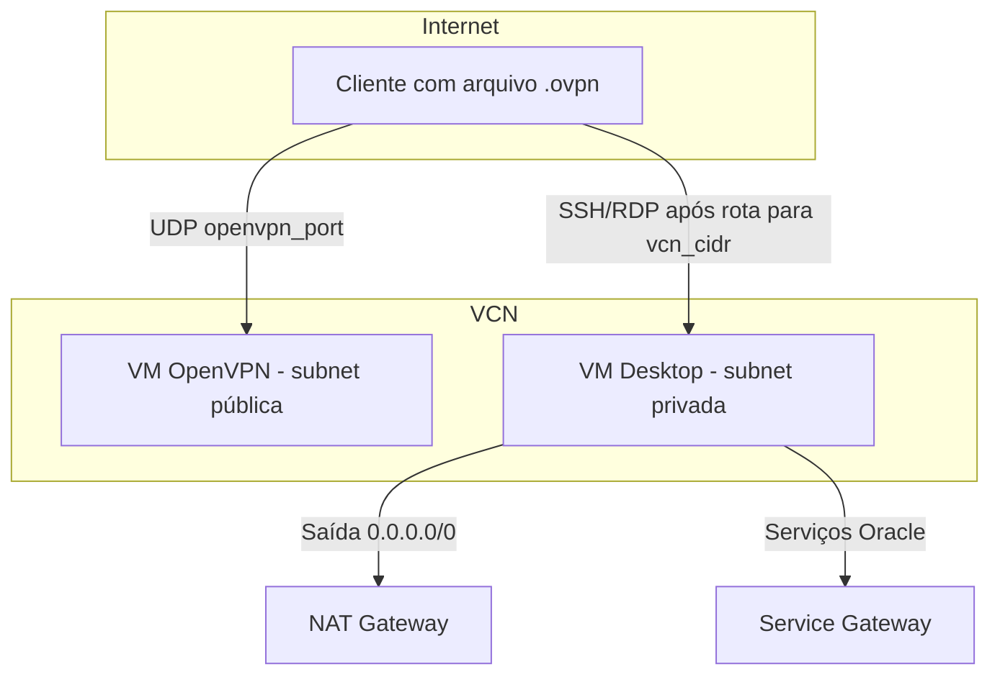

# Instance desktop na OCI (Terraform)

Material de referência e **estudo** do stack `instance-desktop`: uma VCN com **OpenVPN** (subnet pública, IP público) e um **Ubuntu com área de trabalho remota** (subnet privada, sem IP público), saída à internet via **NAT Gateway** e acesso a serviços Oracle via **Service Gateway**.

### Resumo rápido (visão de estudo)

| Pergunta | Resposta em uma linha |
|----------|------------------------|
| O que este Terraform entrega? | Duas VMs: **VPN** (com IP público) e **desktop** (só IP privado), mais rede OCI completa. |
| Como entro no desktop pela internet? | **Não entra direto**: conecta na **VPN** com o `.ovpn`, depois **SSH/RDP** no IP **privado** do desktop. |
| Onde está cada coisa no código? | VPN → `compute_vpn.tf` + `scripts/openvpn-ubuntu-install.sh`; desktop → `compute_desktop.tf` (imagem custom; só `ssh_authorized_keys` no `metadata`). |
| O que o Terraform faz no desktop? | **Cria a VM** com a imagem em `instance_image_id`; **RDP/GUI** vêm da imagem — não há script de bootstrap no repositório. |

**Vocabulário:** mantemos termos usuais em inglês no dia a dia DevOps (`apply`, `output`, `user_data`). O restante do texto está em **português brasileiro**.

---

## Como usar este material

| Se você quer… | Comece por… |
|---------------|-------------|
| Entender *por que* existem duas subnets e dois gateways | [Conceitos essenciais](#1-conceitos-essenciais) e [Arquitetura de rede](#3-arquitetura-de-rede) |
| Subir o ambiente do zero | [Pré-requisitos](#5-pré-requisitos) → [Configuração](#6-configuração-terraformtfvars) → [Comandos Terraform](#7-comandos-terraform) → [Tempo de espera e checklist pós-apply](#71-tempo-de-espera-e-checklist-pós-apply) |
| Conectar na VPN e no desktop depois do `apply` | [Fluxo pós-deploy: VPN → desktop](#8-fluxo-pós-deploy-vpn--desktop) |
| Entender só OpenVPN (scripts, `.ovpn`, `/opt`) | [OpenVPN em profundidade](#9-openvpn-em-profundidade) |
| Entender só o desktop (imagem custom, RDP) | [Desktop: imagem custom e RDP](#10-desktop-imagem-custom-e-rdp) |
| Depurar problemas | [Resolução de problemas](#11-resolução-de-problemas) |

**Sugestão de leitura na primeira vez:** seções 1 → 3 → 5 → 6 → 7 (**incluindo §7.1** sobre espera pós-apply) → 8 (cerca de 25–35 minutos de leitura). As demais servem de apoio quando for implementar ou revisar.

---

## Índice

1. [Conceitos essenciais](#1-conceitos-essenciais)
2. [O que o Terraform cria](#2-o-que-o-terraform-cria)
3. [Arquitetura de rede](#3-arquitetura-de-rede)
4. [Arquivos do módulo (mapa do repositório)](#4-arquivos-do-módulo-mapa-do-repositório)
5. [Pré-requisitos](#5-pré-requisitos)
6. [Configuração (`terraform.tfvars`)](#6-configuração-terraformtfvars)
7. [Comandos Terraform](#7-comandos-terraform) — inclui [checklist após o `apply`](#71-tempo-de-espera-e-checklist-pós-apply)
8. [Fluxo pós-deploy: VPN → desktop](#8-fluxo-pós-deploy-vpn--desktop)
9. [OpenVPN em profundidade](#9-openvpn-em-profundidade)
10. [Desktop: imagem custom e RDP](#10-desktop-imagem-custom-e-rdp)
11. [Resolução de problemas](#11-resolução-de-problemas)
12. [Consistência e limitações](#12-consistência-e-limitações)
13. [Segurança](#13-segurança)
14. [Autoavaliação (checklist de estudo)](#14-autoavaliação-checklist-de-estudo)
15. [Referências](#15-referências)

---

## 1. Conceitos essenciais

### 1.1 Objetivos de aprendizagem

Ao final deste documento você deve ser capaz de:

- Explicar **por que** o desktop não tem IP público e ainda assim acessa internet e VPN.
- Descrever o papel do **NAT Gateway**, **Service Gateway**, **Internet Gateway** e **NSG/Security List**.
- Orquestrar o fluxo: **cliente OpenVPN → IP privado do desktop (SSH/RDP)**.
- Localizar no repositório onde estão **VPN** (`compute_vpn.tf` + script) e **desktop** (`compute_desktop.tf`, imagem custom).
- Saber onde olhar quando **VPN não conecta** ou **RDP não responde**.
- Estimar **quanto esperar** após o `terraform apply` (VPN ainda roda **cloud-init**; desktop depende da imagem).

### 1.2 Glossário rápido

| Termo | Em uma frase |
|-------|----------------|
| **VCN** | Rede virtual na OCI; aqui concentra subnets, rotas e gateways. |
| **Subnet pública (VPN)** | Pode receber IP público na VNIC; rota default costuma ir para o **Internet Gateway**. |
| **Subnet privada (desktop)** | `prohibit_public_ip_on_vnic = true`; sem IP público; saída via **NAT Gateway**. |
| **Internet Gateway (IGW)** | Entrada/saída entre a VCN e a internet (ex.: OpenVPN acessível de fora). |
| **NAT Gateway** | Permite que recursos **sem** IP público iniciem conexões de saída para a internet. |
| **Service Gateway (SGW)** | Acesso à **Oracle Services Network** (repos, APIs Oracle, etc.) sem sair pela internet pública. |
| **NSG / Security List** | Firewall na nuvem: quem pode falar com qual IP/porta (por exemplo SSH/RDP só de certos CIDRs). |
| **`user_data`** | Script ou dados injetados no **primeiro boot** da instância (cloud-init); não reaplica sozinho em VM antiga. |
| **cloud-init** | Serviço que aplica o `user_data` no boot; use `cloud-init status` para saber se o primeiro boot **terminou** (`done` vs `running`). |
| **Split tunnel (OpenVPN)** | Só o tráfego para `vcn_cidr` (e rotas publicadas) passa pelo túnel; o resto sai pela rede local do cliente. |
| **Pool OpenVPN** | Faixa de IPs dos clientes conectados (no script padrão **10.8.0.0/24**); deve bater com `openvpn_client_cidr` no Terraform. |

### 1.3 Objetivo do projeto (negócio / operação)

- **Desktop** acessível por **SSH (22)** e **RDP (3389)** apenas a partir da **subnet da VPN** ou do **pool de clientes OpenVPN** (regras em NSG + Security List).
- **Saída** do desktop: internet via **NAT**; serviços Oracle via **Service Gateway**.
- **Servidor OpenVPN** exposto na internet nas portas que você configurar (**UDP** em `openvpn_port`, **SSH** para administração, conforme CIDRs de ingresso).

---

## 2. O que o Terraform cria

| Camada | Recursos principais | Para que estudar |
|--------|---------------------|------------------|
| **Identity** | `oci_identity_compartment` (home region) + `time_sleep` (propagação) | Compartment filho isolando custo e políticas. |
| **Rede** | VCN, IGW, NAT, SGW, 2 route tables, 2 subnets, Security Lists, NSG | É o “esqueleto” de tráfego; sem isso as VMs não conversam certo com a internet/OSN. |
| **Compute** | Duas `oci_core_instance`: **OpenVPN** e **desktop** | Duas funções distintas: entrada VPN vs. workstation interna. |
| **Dados** | `oci_core_services` (OSN para SGW), data sources de VNIC para outputs | OSN é necessário para anexar o Service Gateway corretamente. |

---

## 3. Arquitetura de rede

### 3.1 Diagrama lógico

```text
                    Internet
                        │
                        ▼
              ┌─────────────────┐
              │ Internet Gateway │  ◄── subnet VPN (IP público na VM OpenVPN)
              └────────┬────────┘
                       │
    ┌──────────────────┴──────────────────┐
    │                 VCN (ex.: /16)        │
    │  ┌─────────────────────────────┐    │
    │  │ Subnet VPN (pública / IGW)  │    │
    │  │   • Instância OpenVPN       │    │
    │  └─────────────────────────────┘    │
    │  ┌─────────────────────────────┐    │
    │  │ Subnet privada (NAT + SGW)  │    │
    │  │   • Desktop (sem IP público)│    │
    │  └─────────────────────────────┘    │
    └─────────────────────────────────────┘
```

### 3.2 Fluxo mental (estudo)



- **Subnet privada:** `prohibit_public_ip_on_vnic = true`; rotas típicas: `0.0.0.0/0` → **NAT**; prefixo da **OSN** → **Service Gateway**.
- **Subnet VPN:** IP público permitido na VNIC; rota default → **Internet Gateway**.

**Por que duas subnets?** Separar **superfície exposta** (VPN) de **carga interna** (desktop sem IP público), alinhando ao princípio de menor exposição direta à internet para o desktop.

---

## 4. Arquivos do módulo (mapa do repositório)

| Arquivo | Função didática |
|---------|-------------------|
| `versions.tf` | Versão mínima do Terraform e *providers*. |
| `providers.tf` | Provider `oci` (workload) e `oci.home` (Identity na home region). |
| `data.tf` | Oracle Services Network (para o Service Gateway). |
| `locals.tf` | Compartment, AD, imagens, OSN. |
| `compartments.tf` | Compartment filho + espera após criação. |
| `network.tf` | VCN, gateways, rotas, subnets, SL, NSG. |
| `compute_vpn.tf` | Instância VPN; `user_data` = `templatefile(openvpn-ubuntu-install.sh)` (modelo wln/psql). |
| `compute_desktop.tf` | Instância desktop; `metadata` com `ssh_authorized_keys` (sem `user_data` no módulo). |
| `variables.tf` | Contrato de entrada do módulo. |
| `outputs.tf` | IPs, comandos sugeridos, hints de SSH/RDP/VPN. |
| `scripts/openvpn-ubuntu-install.sh` | Instala OpenVPN e grava `/opt/openvpn-ubuntu-install.sh` (menu). |
| `terraform.tfvars.example` | Modelo para copiar em `terraform.tfvars`. |

---

## 5. Pré-requisitos

**Dica de estudo:** ajuda ter noções de **Terraform** (`init`, `plan`, `apply`, `output`) e de **rede** (CIDR, rota default, diferença entre IP público e privado). Não é obrigatório dominar OCI antes de ler este README — a tabela **Glossário rápido** (§1.2) cobre os termos usados aqui.

- Terraform **>= 1.3.0** (ver `versions.tf`).
- CLI OCI configurada: `~/.oci/config` com o profile em `oci_config_profile`.
- **Home region** correta em `oci_home_region` (Identity/compartment).
- **Availability Domain** válido em `availability_domain_name` (formato típico: `PREFIXO:REGION-AD-N`).
- Chave **SSH pública** no caminho `ssh_public_key_path`.

---

## 6. Configuração (`terraform.tfvars`)

1. Copie o exemplo: `cp terraform.tfvars.example terraform.tfvars`
2. Preencha no mínimo:
   - `oci_home_region`, `parent_compartment_id`
   - `availability_domain_name`
   - `instance_image_id` (imagem do **desktop**, ex.: custom image)
   - `vpn_image_id` (imagem **só** da VM OpenVPN — Ubuntu Server na mesma região; nunca a mesma custom image do desktop)
   - `ssh_public_key_path` (e `ssh_private_key_path` para outputs de SSH)
3. Ajuste CIDRs para **não se sobreporem** na VCN:
   - `vcn_cidr` (ex.: /16)
   - `private_subnet_cidr` e `vpn_subnet_cidr` (ex.: /24 dentro da VCN)

Variáveis úteis da VPN: `openvpn_port`, `vpn_ssh_ingress_cidr`, `openvpn_udp_ingress_cidr`, `vpn_subnet_cidr`, `openvpn_client_cidr`, `vpn_instance_*`, `extra_admin_cidrs` (detalhes em `variables.tf`).

**Estudo:** o arquivo `terraform.tfvars` costuma estar no `.gitignore` — **não commite** segredos nem OCIDs sensíveis.

---

## 7. Comandos Terraform

```bash
cd /caminho/para/instance-desktop
terraform init
terraform plan -out=tfplan
terraform apply tfplan
```

Inspeção após o apply:

```bash
terraform output
terraform output -raw vpn_public_ip
```

### 7.1 Tempo de espera e checklist pós-apply

Depois que o **`terraform apply`** termina, a **VM OpenVPN** ainda costuma estar no primeiro boot: **cloud-init** aplica o `user_data` (script OpenVPN). **Não é instantâneo.** O **desktop** neste módulo **não** recebe `user_data` do Terraform — o tempo até SSH/RDP útil depende do boot da **imagem custom** (em geral bem menor que uma instalação completa via `apt`).

#### Quanto esperar (ordem de grandeza)

| VM | Tempo típico | O que demora |
|----|----------------|--------------|
| **OpenVPN** | **~5 a 15 minutos** | `apt`, Easy-RSA, OpenVPN, primeiro `.ovpn` |
| **Desktop** | **~2 a 10 minutos** (ordem de grandeza) | Boot do SO + serviços já presentes na imagem (ex.: xrdp) |

**Regra prática:** espere **pelo menos 10 a 15 minutos** após o apply e só então tente **SSH no IP público da VPN**. Para o **desktop**, após a VPN estar OK, teste **SSH/RDP**; se falhar, veja **§11.2** e serviços na própria VM.

**Sinal mais confiável (VPN):** na VM VPN, `sudo cloud-init status` deve mostrar **`status: done`** antes de contar com o `.ovpn` inicial.

#### O que checar (ordem sugerida para estudo / operação)

**1) Na sua estação (Terraform)**

```bash
terraform output
```

Anote `vpn_public_ip`, `desktop_private_ip` e os comandos sugeridos pelos outputs.

**2) VM da VPN (IP público — acessível pela internet)**

```bash
ssh -i ~/.ssh/SUA_CHAVE ubuntu@IP_PUBLICO_VPN
sudo cloud-init status
sudo tail -50 /var/log/cloud-init-output.log
```

Validação rápida do OpenVPN:

```bash
sudo test -f /etc/openvpn/client-configs/files/openvpn-config.ovpn && echo "perfil inicial OK"
```

**3) VM do desktop (só IP privado — use SSH a partir da VPN já ligada, ou de outra VM na VCN)**

```bash
ssh -i ~/.ssh/SUA_CHAVE SEU_USUARIO@IP_PRIVADO_DESKTOP
```

(`SEU_USUARIO` = `cloud_init_user` no `terraform.tfvars`, alinhado ao usuário que existe na **imagem custom**.)

Validação do RDP (se a imagem tiver xrdp):

```bash
systemctl is-active xrdp xrdp-sesman
sudo ss -tlnp | grep 3389
```

**4) No seu notebook (com VPN OpenVPN conectada)** — teste **RDP** para `IP_PRIVADO_DESKTOP:3389` com o **usuário e senha definidos na sua imagem custom** (não são criados pelo Terraform).

#### Se o RDP não responder logo após o `apply`

Confirme que a VM **terminou de bootar** e que **xrdp** está ativo na imagem; use **§11.2** e o output `desktop_rdp`.

---

## 8. Fluxo pós-deploy: VPN → desktop

### 8.1 Saídas importantes (`terraform output`)

| Output | Uso |
|--------|-----|
| `vpn_public_ip` | IP público do servidor OpenVPN (UDP em `openvpn_port`). |
| `vpn_ssh_cmd` | SSH para administrar a VM da VPN. |
| `openvpn_menu_cmd` | No servidor VPN: `sudo bash /opt/openvpn-ubuntu-install.sh` (menu). |
| `desktop_private_ip` | IP **privado** do desktop. |
| `ssh_cmd` | SSH ao desktop **depois** da VPN (usuário `cloud_init_user`, ex.: `ubuntu`). |
| `rdp_hint` | `IP_PRIVADO:3389` para o cliente RDP **depois** da VPN. |
| `desktop_rdp` | Objeto com IP da VPN, IP do desktop, porta 3389 e lembrete de credenciais na imagem. |
| `vpn_access_note` | Lembrete sobre CIDRs e regras. |

### 8.2 Passo a passo (ordem didática)

1. **Obtenha o primeiro `.ovpn`** no servidor VPN (perfil padrão `openvpn-config`) — ver [9.3](#93-primeiro-perfil-ovpn).
2. No seu notebook, importe o `.ovpn` no cliente OpenVPN e **conecte** usando o **IP público** da VPN.
3. Com o túnel ativo, o cliente recebe IP do pool (ex.: 10.8.x.x) e passa a alcançar o **`vcn_cidr`** (split tunnel).
4. **SSH** ou **RDP** ao **IP privado** do desktop (`desktop_private_ip` / `rdp_hint`). Não existe rota direta da internet pública para o desktop.

**Usuários:** ajuste **`cloud_init_user`** para o login SSH que existe na **imagem custom**. **RDP** usa usuário/senha que você definiu ao preparar a imagem (fora do Terraform).

---

## 9. OpenVPN em profundidade

### 9.1 Como o Terraform entrega a VPN

- Em `compute_vpn.tf`, o `user_data` é só `templatefile("scripts/openvpn-ubuntu-install.sh", { vcn_cidr, openvpn_port })`, no mesmo estilo do stack **wln/psql**.
- Ao **final** da instalação inicial, o script grava **`/opt/openvpn-ubuntu-install.sh`**: menu (novo cliente, revogar, remover). A porta no `remote` dos `.ovpn` gerados pelo menu é alinhada com `openvpn_port` (via `sed`), como no wln/psql.
- Se o OpenVPN **já estiver rodando** e o script for executado de novo, o fluxo mostra o **menu** em vez de reinstalar tudo.
- Imagens suportadas no script: **Ubuntu** 20.04 / 22.04 / 24.04.

### 9.2 Arquivos no servidor Linux (mapa mental)

| Caminho | Conteúdo |
|---------|----------|
| `/etc/openvpn/easy-rsa/` | PKI Easy-RSA (CA, servidor, clientes). |
| `/etc/openvpn/server/server.conf` | Configuração do daemon. |
| `/etc/openvpn/client-configs/base.conf` | Base do primeiro cliente (`remote` = IP público no install). |
| `/etc/openvpn/client-configs/files/` | Arquivos `.ovpn` (ex.: `openvpn-config.ovpn`). |
| **`/opt/openvpn-ubuntu-install.sh`** | Menu interativo — comando: `sudo bash /opt/openvpn-ubuntu-install.sh`. |

### 9.3 Primeiro perfil `.ovpn`

- Nome fixo no instalador: **`openvpn-config`**.
- Caminho no servidor: **`/etc/openvpn/client-configs/files/openvpn-config.ovpn`**.
- O arquivo é legível como root; no seu PC use `sudo cat` via SSH.

**Com IP vindo do Terraform** (rode `terraform output` no diretório do stack):

```bash
mkdir -p /home/cleverson/ovpn-clients
VPN_IP="$(terraform output -raw vpn_public_ip)"
ssh -i ~/.ssh/sua_chave.pem ubuntu@"$VPN_IP" \
  'sudo cat /etc/openvpn/client-configs/files/openvpn-config.ovpn' \
  > /home/cleverson/ovpn-clients/openvpn-config.ovpn
```

**Exemplo com variável e chave `instance-oci.key`:**

```bash
mkdir -p /home/cleverson/ovpn-clients
VPN_IP="COLOQUE_AQUI_O_IP_PUBLICO"   # ex.: saída de terraform output -raw vpn_public_ip
ssh -i ~/.ssh/instance-oci.key ubuntu@"$VPN_IP" \
  'sudo cat /etc/openvpn/client-configs/files/openvpn-config.ovpn' \
  > /home/cleverson/ovpn-clients/openvpn-config.ovpn
```

Ajuste o usuário (`ubuntu`) e a chave (`-i`) conforme o seu ambiente.

### 9.4 Perfis adicionais e menu em `/opt`

No servidor VPN:

```bash
sudo bash /opt/openvpn-ubuntu-install.sh
```

- Opção **1**: novo cliente → `.ovpn` em `/etc/openvpn/client-configs/files/<nome>.ovpn`.
- Opções **2** e **3**: revogar ou remover OpenVPN (esta última apaga também `/opt/openvpn-ubuntu-install.sh`).

Não use o modelo antigo `openvpn-add-client` em `/usr/local/bin` — foi substituído por este menu.

### 9.5 Pool 10.8.0.0/24 e `openvpn_client_cidr`

- O instalador usa `server 10.8.0.0 255.255.255.0` (pool de clientes).
- As regras do **desktop** usam `openvpn_client_cidr` (padrão **10.8.0.0/24**) para permitir SSH/RDP a partir desse pool.
- Se mudar o pool no script OpenVPN, atualize **`openvpn_client_cidr`** e o firewall (iptables no script) de forma **coerente**.

### 9.6 Outros repositórios (wln/psql, oke-crs)

- Referência de script: `IaC/terraform/oci/dbsystems/wln/psql/scripts/openvpn-ubuntu-install.sh`.
- Outros projetos (ex.: `oke-crs`) podem ter `user_data` diferente; alinhe scripts se quiser o mesmo menu em `/opt`.

### 9.7 `user_data` e VMs antigas

O cloud-init do `user_data` roda em geral **só no primeiro boot**. Mudar o `.tf` não atualiza uma VM já criada até você **recriar** a instância ou aplicar mudanças **manualmente** no SO.

---

## 10. Desktop: imagem custom e RDP

### 10.1 Ideia central

O desktop é provisionado com **`instance_image_id`** (imagem **custom** na OCI, por exemplo após import de disco). O Terraform injeta apenas **`ssh_authorized_keys`** no `metadata` da instância — **não** há script de primeiro boot nem `user_data` no módulo para instalar GUI/xrdp.

### 10.2 O que você precisa na imagem

- **xrdp** (e sessão gráfica) já configurados, ou outro stack de acesso remoto que escute na **3389/tcp** se quiser usar o mesmo fluxo RDP.
- Usuário(s) e senhas de **RDP** definidos por você ao preparar a imagem.
- Usuário para **SSH** alinhado com **`cloud_init_user`** no `terraform.tfvars`.

### 10.3 Rede (OCI)

A NSG + Security List do desktop liberam **3389** e **22** a partir de **`vpn_subnet_cidr`** e **`openvpn_client_cidr`**. O cliente precisa estar com **VPN ligada** para alcançar o IP **privado** do desktop.

### 10.4 Verificação rápida (SSH na VM)

```bash
systemctl is-active xrdp xrdp-sesman 2>/dev/null || true
sudo ss -tlnp | grep 3389 || true
```

Se o serviço não existir, o problema está na **imagem** ou no SO, não no Terraform.

---

## 11. Resolução de problemas

### 11.1 OpenVPN

| Sintoma | O que verificar |
|---------|------------------|
| VPN não conecta | NSG/SL da subnet VPN: UDP na `openvpn_port`; `ufw` no servidor; serviço `openvpn-server@server` ou `openvpn@server`. |
| VPN conecta mas não alcança o desktop | Rota no cliente para `vcn_cidr`; `openvpn_client_cidr` e regras NSG/SL do desktop; serviços na VM (xrdp/SSH). |
| Não aparece `.ovpn` | Aguardar cloud-init; `/var/log/cloud-init-output.log` na VM VPN. |
| Novo cliente inválido | Menu em `/opt`, opção 1; conferir `.ovpn` completo e porta em `server.conf`. |

### 11.2 Desktop / RDP

| Sintoma | O que verificar |
|---------|------------------|
| RDP recusa conexão | VPN ligada; IP privado correto; `systemctl status xrdp xrdp-sesman`; firewall **na VM** (UFW/iptables) e **NSG** (CIDRs VPN / pool OpenVPN). |
| SSH funciona mas RDP não | Imagem sem xrdp ou serviço parado; usuário RDP diferente do SSH — conferir documentação da sua imagem custom. |
| Porta 3389 fechada | `systemctl status xrdp`; `ss -tlnp \| grep 3389`; UFW; NSG (mesmos CIDRs que SSH se o cliente é o mesmo). |
| Cliente Windows bloqueia RDP | Algumas redes bloqueiam **saída** TCP 3389 mas não 22 — testar `Test-NetConnection -Port 3389` do PC. |

---

## 12. Consistência e limitações

- **`openvpn_client_cidr`** deve refletir o pool real do OpenVPN (padrão no script **10.8.0.0/24**).
- **State / renomeações de recursos**: mudanças podem exigir `terraform state mv` ou recriação.
- **Shapes Flex**: `shape_config` só quando o nome do shape contém `"Flex"`.
- **Região**: `oci_core_services` filtra pela região do provider; valide o *plan* em regiões novas.

---

## 13. Segurança

- Restrinja `vpn_ssh_ingress_cidr` e `openvpn_udp_ingress_cidr` (evite `0.0.0.0/0` em produção se possível); use credenciais fortes na **imagem custom**.
- Use `extra_admin_cidrs` com parcimônia no NSG do desktop.
- Alinhe **defined_tags** à política da tenancy.

---

## 14. Autoavaliação (checklist de estudo)

Tente responder **sem** olhar as seções anteriores. Depois confira o gabarito sugestivo abaixo.

1. Por que o desktop usa **NAT Gateway** em vez de IP público?
2. Qual a diferença entre tráfego para **internet** e tráfego para **Oracle Services Network** nesta VCN?
3. O que é **`openvpn_client_cidr`** e o que acontece se ele não bater com o pool do servidor OpenVPN?
4. O que o Terraform **não** faz no desktop neste módulo (além de criar a VM e a chave SSH)?
5. Por que SSH e RDP podem usar **usuários diferentes** na prática?
6. Por que você precisa da **VPN** ligada antes de testar RDP no IP do desktop?

<details>
<summary><strong>Gabarito sugestivo</strong> (clique para expandir)</summary>

1. **NAT:** o desktop fica na subnet **privada** (sem IP público na VNIC). Para acessar a internet com origem nesse IP privado, o tráfego de saída passa pelo **NAT Gateway** (SNAT). Assim você não expõe o desktop diretamente na internet.
2. **Internet vs OSN:** tráfego para **0.0.0.0/0** (internet) sai pela rota para o **NAT Gateway**. Tráfego para prefixos da **Oracle Services Network** (repos, APIs geridas pela Oracle na região) usa o **Service Gateway**, sem sair pela internet pública — melhor custo e caminho privado aos serviços Oracle.
3. **`openvpn_client_cidr`:** CIDR dos IPs que os **clientes OpenVPN** recebem ao conectar (no script padrão, pool **10.8.0.0/24**). As regras do **desktop** liberam SSH/RDP a partir desse intervalo. Se o Terraform apontar para um CIDR **diferente** do pool real no servidor OpenVPN, o firewall na nuvem pode **bloquear** SSH/RDP mesmo com VPN ligada.
4. **Sem bootstrap no módulo:** não envia `user_data` para instalar pacotes; **GUI/xrdp** e usuários vêm só da **imagem custom**.
5. **Dois usuários:** o SSH nos outputs usa **`cloud_init_user`** (ex.: `ubuntu`); o login **RDP** segue o que você definiu na imagem — podem ser contas distintas.
6. **Sem rota pública para o desktop:** a VNIC do desktop não tem IP público; o tráfego RDP precisa vir da **VCN** (ex.: notebook com **VPN** e rota para `vcn_cidr`).

</details>

---

## 15. Referências

- [OCI Terraform Provider](https://registry.terraform.io/providers/oracle/oci/latest/docs)
- [VCN, subnets, gateways](https://docs.oracle.com/iaas/Content/Network/Concepts/overview.htm)
- Detalhes de variáveis: `variables.tf`
